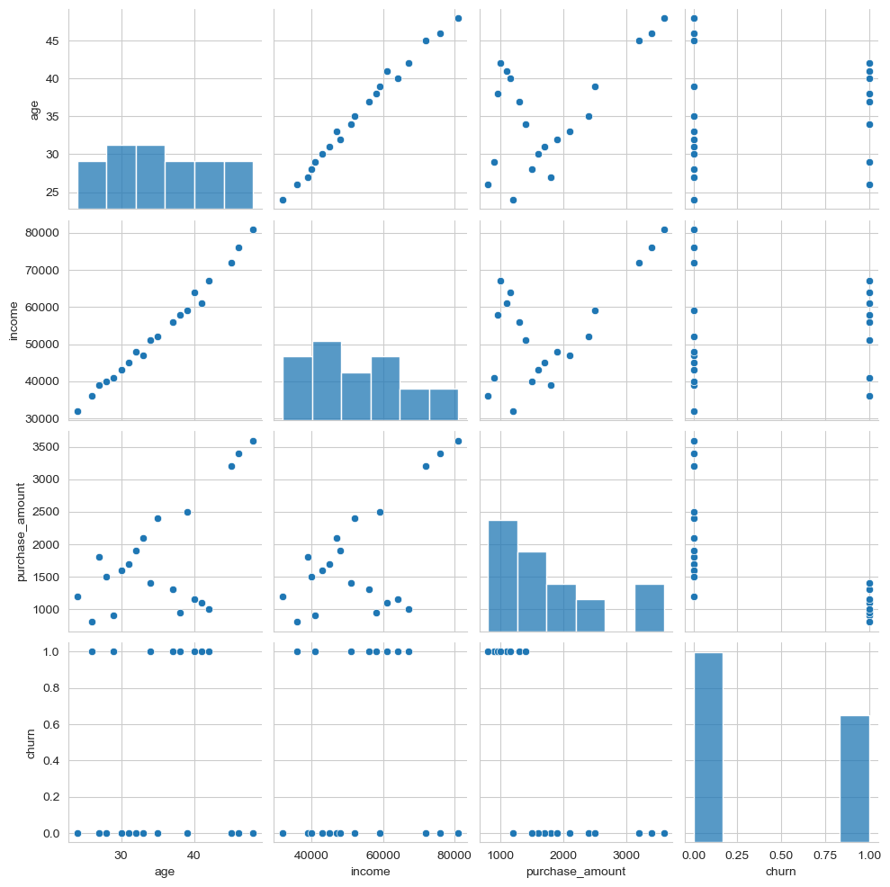

# Customer Churn Data Preprocessing and Feature Engineering 📊


> A complete academic mini-project on multi-source data loading, preprocessing, exploratory data analysis, and profiling for customer churn prediction.

## 🌟 Project Snapshot

This project was created as part of a data preprocessing and feature engineering assignment. It shows how real-world customer data can be collected from different formats, cleaned carefully, explored visually, and prepared for machine learning.

The full workflow is implemented in a Jupyter Notebook and supported by reports, screenshots, and a final cleaned dataset for submission.

## 🔗 Quick Links

- [Open Notebook](customer_churn_analysis.ipynb)
- [Final Cleaned Dataset](data/final_cleaned_dataset.csv)
- [Profiling Report](reports/profile_report.html)
- [Theory Report PDF](reports/theory_report.pdf)
- [Screenshots Folder](screenshots)

## 📚 Table of Contents

- [🌟 Project Snapshot](#-project-snapshot)
- [🎯 Objective](#-objective)
- [🧠 Problem Statement](#-problem-statement)
- [✅ What This Project Covers](#-what-this-project-covers)
- [🗃️ Data Sources](#️-data-sources)
- [🛠️ Tools and Libraries](#️-tools-and-libraries)
- [🔄 Workflow Summary](#-workflow-summary)
- [📌 Final Dataset Summary](#-final-dataset-summary)
- [📈 Visual Analysis](#-visual-analysis)
- [📁 Project Structure](#-project-structure)
- [▶️ How to Run](#️-how-to-run)
- [📦 Submission Files Included](#-submission-files-included)
- [🎓 Academic Submission Notes](#-academic-submission-notes)
- [🏁 Conclusion](#-conclusion)

## 🎯 Objective

The objective of this project is to:

- understand customer purchase behavior data
- clean and transform data from multiple sources
- perform exploratory data analysis
- generate an automated profiling report
- prepare a machine-learning-ready dataset for churn prediction

## 🧠 Problem Statement

A consumer insights company wants to predict whether a customer will churn based on:

- demographic information
- purchase activity
- support behavior
- customer engagement details

This is treated as a **binary classification problem** where:

- `0` = customer retained
- `1` = customer churned

## ✅ What This Project Covers

- CSV data loading using Pandas
- JSON parsing
- SQL database connection and record fetching
- API-style data handling
- dataset merging using `customer_id`
- missing value handling
- duplicate removal
- data type correction
- univariate, bivariate, and multivariate EDA
- automated HTML profiling report
- theory report in Markdown and PDF

## 🗃️ Data Sources

| Source | File | Description |
|---|---|---|
| CSV | `data/customers.csv` | Customer demographic details |
| JSON | `data/purchases.json` | Purchase behavior and order data |
| SQL | `data/support.db` | Support records and complaint details |
| API-style JSON | `data/api_data.json` | Engagement-related customer information |
| Final Output | `data/final_cleaned_dataset.csv` | Cleaned dataset used for analysis |

## 🛠️ Tools and Libraries

- Python
- Pandas
- NumPy
- SQLite
- JSON
- Requests
- Matplotlib
- Seaborn
- Jupyter Notebook
- ydata-profiling

## 🔄 Workflow Summary

1. Loaded data from CSV, JSON, SQL, and API-style files.
2. Merged all source files using `customer_id`.
3. Explored the combined dataset using:
   - `.head()`
   - `.info()`
   - `.describe()`
   - missing value checks
   - duplicate checks
4. Cleaned the data by correcting data types and handling inconsistencies.
5. Performed feature-oriented analysis for churn understanding.
6. Generated EDA charts and profiling outputs.
7. Saved the final cleaned dataset for future machine learning use.

## 📌 Final Dataset Summary

| Metric | Value |
|---|---:|
| Rows | `20` |
| Columns | `12` |
| Churn Rate | `40.0%` |
| Average Income | `53,400` |
| Average Purchase Amount | `1,775` |

Main columns in the cleaned dataset:

- `customer_id`
- `age`
- `gender`
- `income`
- `churn`
- `purchase_amount`
- `total_orders`
- `tenure_months`
- `complaint_count`
- `refund_requests`
- `avg_resolution_days`
- `support_channel`

## 📈 Visual Analysis

### Customer and Purchase Data Preview


### SQL and API Data Preview


### Univariate Analysis


### Bivariate Analysis


### Multivariate Analysis




## 📁 Project Structure

```text
Pr 1/
|- customer_churn_analysis.ipynb
|- README.md
|- data/
|  |- api_data.json
|  |- customers.csv
|  |- final_cleaned_dataset.csv
|  |- purchases.json
|  `- support.db
|- reports/
|  |- profile_report.html
|  |- theory_report.md
|  `- theory_report.pdf
`- screenshots/
   |- Customer & Purchase Data.png
   |- SQL & API Data.png
   |- Univariate Analysis.png
   |- Univariate Analysis 2.png
   |- Univariate Analysis 3.png
   |- Bivariate Analysis.png
   |- Bivariate Analysis 2.png
   |- Multivariate Analysis.png
   `- Pairplot.png
```

## ▶️ How to Run

1. Open `customer_churn_analysis.ipynb` in Jupyter Notebook or Google Colab.
2. Make sure the `data/` folder stays in the same project directory.
3. Run the notebook cells in sequence.
4. Open `reports/profile_report.html` in a browser to view the profiling report.

## 📦 Submission Files Included

- `customer_churn_analysis.ipynb`
- `data/customers.csv`
- `data/purchases.json`
- `data/support.db`
- `data/api_data.json`
- `data/final_cleaned_dataset.csv`
- `reports/profile_report.html`
- `reports/theory_report.md`
- `reports/theory_report.pdf`
- `README.md`

## 🎓 Academic Submission Notes

This project follows the required submission guidelines by including:

- practical implementation in a Jupyter Notebook
- labeled charts with analysis-ready outputs
- source files from multiple formats
- a theory report in PDF form
- a descriptive GitHub README

## 🏁 Conclusion

This project successfully demonstrates how customer churn data can be collected from multiple sources, cleaned, analyzed, and documented in a professional workflow. The final dataset, charts, and reports provide a strong base for future churn prediction modeling and make the project suitable for academic submission as well as GitHub presentation. 🚀
